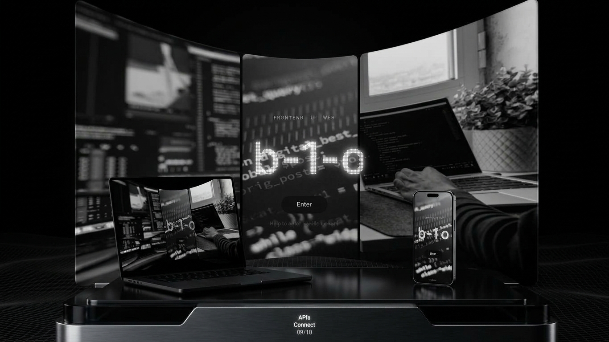

# myUI


A personal frontend playground and portfolio — a space for experimenting with layouts, typography, motion, and micro-interactions. Ideas that start here often end up in real projects.

## Live Demo
[b-1-o.github.io/myUI](https://b-1-o.github.io/myUI/)




## What is this
myUI is not a product — it's a workbench. It's where I test interface ideas before they land in production work: layout rhythm, hover states, transitions, typography experiments, and small interaction details that are hard to justify in a client project but matter for the craft.

Some experiments become reusable patterns; others stay as sketches. Both are useful.

## What's inside
- Layout experiments (grid, spacing, responsive rhythm)
- Motion studies (hover, scroll, entry transitions)
- Typography and hierarchy tests
- Micro-interactions and UI details
- Component sketches with CSS-only approaches
- Occasional full-page compositions

## Tech Stack
React · JavaScript · CSS · Vite · GitHub Pages

## How it works
- Each experiment lives as a standalone section or page.
- Styles are written in plain CSS — no utility frameworks — to keep experiments honest about layout fundamentals.
- The project deploys automatically to GitHub Pages on push via GitHub Actions.

## Getting Started
```bash
git clone https://github.com/b-1-o/myUI.git
cd myUI
npm install
npm run dev
```
